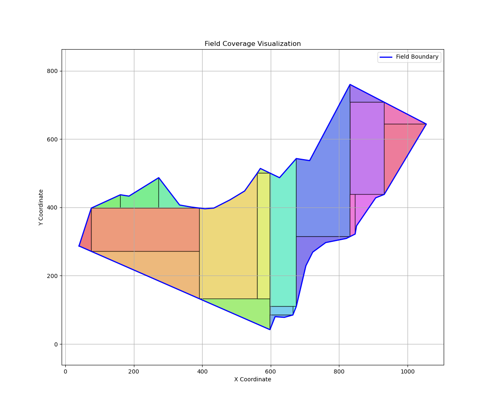
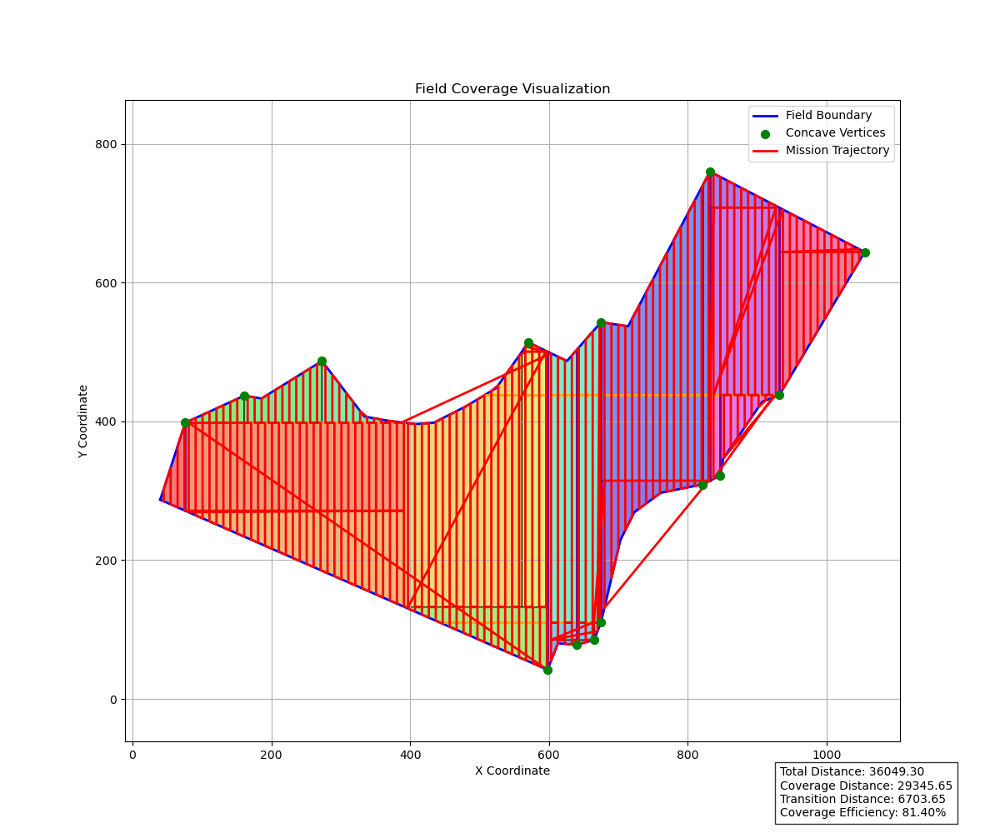
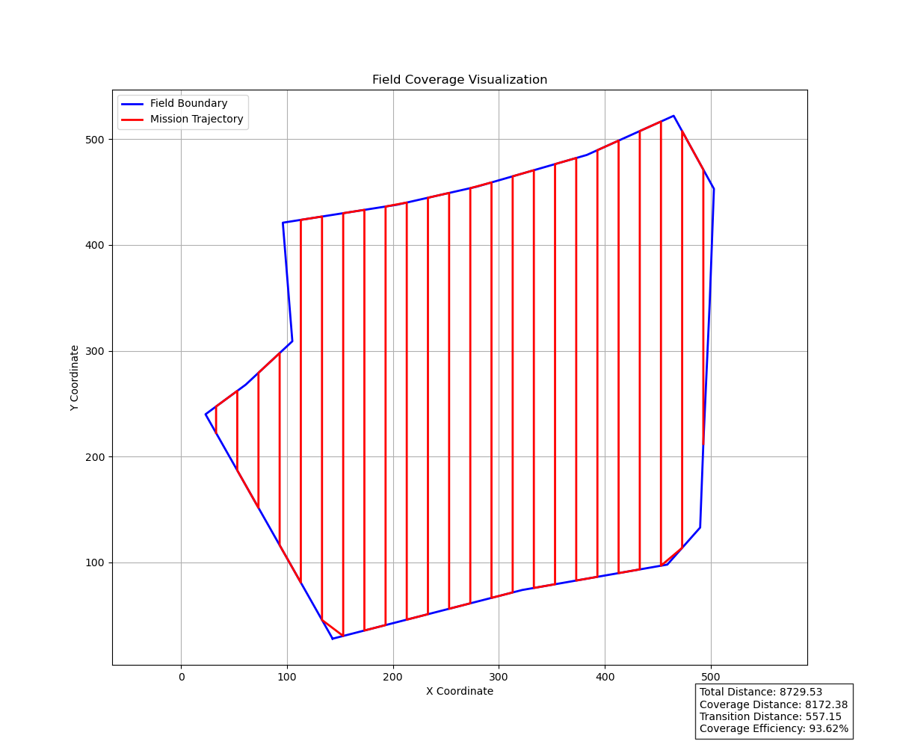
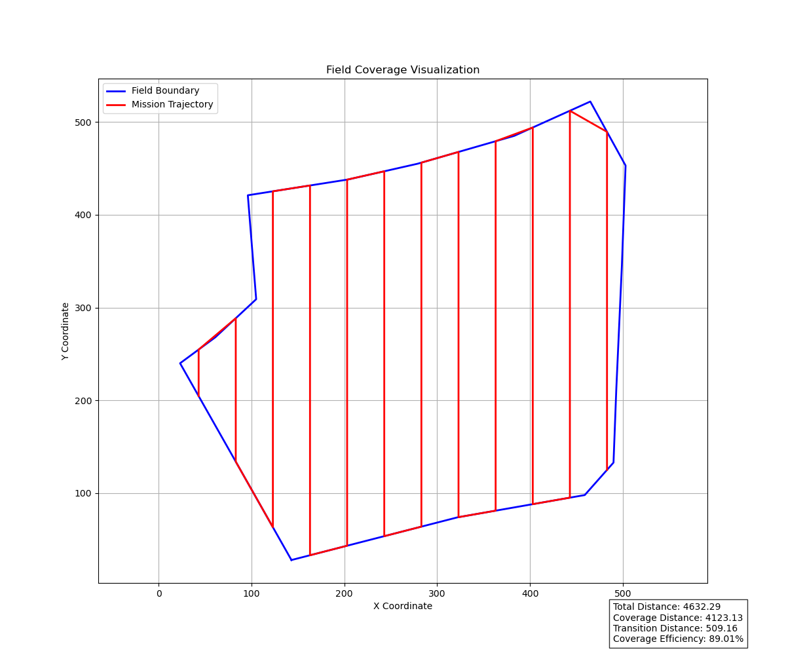

# CropFleet

A computational geometry research prototype for **heuristic coverage path planning** in autonomous systems. CropFleet implements experimental algorithms for waypoint mission synthesis on irregular planar domains using recursive polygon decomposition, sweep-line clipping, and geometric transition generation.

## Overview

CropFleet is a research implementation exploring cellular decomposition and coverage path planning methodologies:

- **Heuristic recursive decomposition** via concavity detection and split-line validation
- **Parallel sweep-line clipping** for coverage lane generation on decomposed cells
- **Boustrophedon traversal ordering** (experimental; heuristic-based)
- **Experimental geometric transition smoothing** using Bezier interpolation
- **Coverage metrics and path analysis** for comparative algorithm evaluation
- **Interactive polygon sketching** and offline visualization

**Note:** This project is a research prototype under active development. Algorithmic components are heuristic and experimental. Current methods prioritize geometric coverage completeness over trajectory optimality or constraint satisfaction.

## Scope

This project is **focused on geometric mission planning research** and does not currently include:
- Flight control or vehicle dynamics
- Real-time autonomy or replanning
- Localization or state estimation
- Hardware deployment or middleware integration
- Multi-agent coordination (future research direction)

---

## Computational Pipeline

```
     Input Polygon
            ↓
    ┌─────────────────────┐
    │ Polygon Validation  │
    └─────────────────────┘
            ↓
    ┌──────────────────────────────────────┐
    │ Heuristic Recursive Decomposition    │
    │ (Concavity Detection + Splitting)    │
    └──────────────────────────────────────┘
            ↓
    ┌──────────────────────────┐
    │ Decomposed Cell Set      │
    └──────────────────────────┘
            ↓
    ┌──────────────────────────────────────┐
    │ Parallel Sweep-Line Coverage         │
    │ (Per-Cell Lane Generation)           │
    └──────────────────────────────────────┘
            ↓
    ┌──────────────────────────┐
    │ Coverage Segment Set     │
    └──────────────────────────┘
            ↓
    ┌──────────────────────────────────────┐
    │ Heuristic Traversal Ordering         │
    │ (Boustrophedon-style Alternation)    │
    └──────────────────────────────────────┘
            ↓
    ┌──────────────────────────┐
    │ Ordered Segment Sequence │
    └──────────────────────────┘
            ↓
    ┌──────────────────────────────────────┐
    │ Mission Waypoint Synthesis           │
    │ (Endpoint Connection)                │
    └──────────────────────────────────────┘
            ↓
    ┌──────────────────────────┐
    │ Waypoint Sequence        │
    └──────────────────────────┘
            ↓
    ┌──────────────────────────────────────┐
    │ Experimental Transition Smoothing    │
    │ (Bezier Interpolation)               │
    └──────────────────────────────────────┘
            ↓
    ┌──────────────────────────┐
    │ Smoothed Path Sequence   │
    └──────────────────────────┘
            ↓
    ┌──────────────────────────────────────┐
    │ Metrics & Visualization              │
    └──────────────────────────────────────┘
```

---

## System Architecture

The planning pipeline is structured as a series of geometric processing stages:

```
1. Field Polygon Definition
   └─ Load and validate field boundary

2. Heuristic Recursive Decomposition
   └─ Detect concave vertices and recursively partition complex geometries

3. Coverage Lane Generation
   └─ Generate parallel sweep lines clipped to decomposed cells

4. Traversal Ordering (Heuristic)
   └─ Order lanes using boustrophedon-style alternation

5. Mission Waypoint Generation
   └─ Connect ordered segments into waypoint sequence

6. Experimental Transition Smoothing
   └─ Apply Bezier interpolation between segment endpoints

7. Metrics & Analysis
   └─ Calculate coverage efficiency and path statistics

8. Visualization
   └─ Display results and performance metrics
```

---

## Algorithmic Details

### Concavity Detection

Identifies reflex (concave) vertices in the polygon using the cross-product test on consecutive edge vectors. Determines polygon winding order via the shoelace formula, then applies signed cross-product analysis to classify vertices.

### Recursive Polygon Decomposition

Heuristic recursive splitting strategy that:
1. Detects all concave vertices
2. Generates horizontal and vertical split-line candidates from each concave point to polygon boundary
3. Validates splits (checks that they create ≥2 separate pieces)
4. Selects the longest valid split to partition the polygon
5. Recursively applies decomposition to child polygons until:
   - Polygon area ≤ 0.5% of original, OR
   - Polygon is convex (no concave vertices), OR
   - No valid splits exist

Child polygons are rejected if they exhibit extreme aspect ratios (>10:1) to avoid pathological slivers.

### Parallel Sweep-Line Clipping

Generates vertical parallel lines at regular spacing across the bounding box. Each line is extended beyond polygon bounds and intersected with the polygon geometry. Valid intersection segments are retained as coverage lanes.

### Traversal Ordering (Heuristic)

Implements a simple boustrophedon-style heuristic: orders coverage segments sequentially while alternating traversal direction (forward/backward) to reduce turn-around transitions. **Note:** This is a basic ordering heuristic; no graph-based optimization or endpoint-distance minimization is performed. Inter-cell traversal remains unoptimized.

### Transition Smoothing

Generates Bezier curve interpolation between segment endpoints using a quadratic Bezier formula with fixed control-point placement. **Warning:** Smoothed curves may exit the original polygon boundary; this is visualization-oriented interpolation, not constraint-aware trajectory generation.

---

## Results & Visualization

### Polygon Decomposition (Heuristic Recursive Splitting)

Complex polygons are partitioned using concavity detection and split-line validation:



**Visualization Elements:**
- **Blue**: Original polygon boundary
- **Green**: Detected concave vertices (reflex angles)
- **Orange & Purple**: Candidate split lines (horizontal and vertical)

This heuristic decomposition approach exploits concave vertices to partition complex geometries into simpler cells. The method is not optimal; it is experimental and uses greedy split selection (longest candidate line).

### Coverage Lane Generation from Decomposed Cells

Parallel sweep-line clipping is applied to each decomposed cell:



Lanes are clipped to cell boundaries with configurable spacing. Lane orientation is fixed (vertical sweep lines); no dynamic orientation selection is implemented.

### Lane Spacing Configurations

Comparative coverage with different lane spacings:


**Lane Spacing: 20 units** - Higher density coverage, increased path length


**Lane Spacing: 40 units** - Standard spacing, baseline efficiency

Lane spacing is a parameter; optimal spacing selection is not automated.

### Mission Waypoint Path

Connected waypoints from ordered coverage segments:


### Smoothed Mission with Experimental Transition Interpolation

Quadratic Bezier curve interpolation applied between segment transitions:


**Note:** Transition smoothing is visualization-oriented geometric interpolation. Smoothed curves may exit the original polygon boundary and do not respect dynamics constraints. This is not trajectory planning; it is heuristic path visualization.

**Example Metrics:**
- Total Path Distance: 4570.52 pixels
- Coverage Distance: 3949.15 pixels  
- Transition Distance: 621.37 pixels
- **Coverage Efficiency: 86.40%**

---

## Project Structure

```
coverage_planner/
├── coverage/          # Lane generation and clipping
├── environments/      # Field polygon loading and bounds
├── metrics/           # Mission statistics and analysis
├── mission/           # Waypoint generation and smoothing
├── path/              # Traversal ordering
├── sketcher/          # Interactive boundary mapping
└── visualization/     # Mission visualization
```

---

## Usage

### Field Boundary Mapping

```bash
python3 -m coverage_planner.sketcher.map_bound
```
Interactive tool for defining field boundaries from reference images.

### Generate and Visualize Coverage Mission

```bash
python3 -m coverage_planner.visualization.visualization
```
Generates coverage lanes, plans traversal, and displays mission statistics.

### Python API Usage

```python
from shapely.geometry import Polygon
from coverage_planner.coverage.coverage_pipeline import run_pipe
from coverage_planner.path.traversal_generator import generate_traversal
from coverage_planner.mission.mission_generator import generate_mission
from coverage_planner.metrics.mission_metrics import calculate_all_metrics

# Define field polygon
field = Polygon([(0, 0), (100, 0), (100, 100), (0, 100)])

# Generate coverage segments
segments = run_pipe(field)

# Create traversal path
traversal = generate_traversal(segments)

# Generate mission waypoints
waypoints = generate_mission(traversal)

# Calculate metrics
metrics = calculate_all_metrics(waypoints, traversal)
print(f"Coverage Efficiency: {metrics['coverage_efficiency']:.2f}%")
```

---

## Installation

### Requirements

- Python 3.8+
- NumPy
- Matplotlib
- Shapely
- OpenCV (cv2)

### Setup

```bash
# Clone repository
git clone https://github.com/yourusername/CropFleet.git
cd CropFleet

# Install dependencies
pip install numpy matplotlib shapely opencv-python

# Run visualization
python3 -m coverage_planner.visualization.visualization
```

---

## Research & Development

### Current Focus

- Heuristic recursive polygon decomposition via concavity detection
- Parallelizable sweep-line coverage generation
- Boustrophedon-style traversal ordering strategies
- Coverage metrics, efficiency analysis, and comparative benchmarking
- Polygon input validation and boundary extraction

### Future Directions

- Advanced cellular decomposition methods (trapezoidal, Voronoi-based)
- Multi-region field partitioning and hierarchical planning
- Constraint-aware trajectory smoothing (boundary-aware, curvature-limited)
- Obstacle modeling and avoidance integration
- Dynamic replanning and real-time autonomy frameworks
- Multi-agent field decomposition and cooperative planning

---

## Current Research Challenges

The following areas represent active research problems in this codebase:

1. **Inter-Cell Traversal Optimization**
   - Current: Direct endpoint-to-endpoint connections
   - Challenge: Minimize transition cost between decomposed cells; consider adjacency relationships

2. **Transition Minimization**
   - Current: Fixed alternating traversal direction (heuristic)
   - Challenge: Optimize traversal ordering using graph-based methods or dynamic programming

3. **Constraint-Aware Smoothing**
   - Current: Visualization-oriented Bezier interpolation (boundary-unaware)
   - Challenge: Generate smooth trajectories respecting polygon boundary constraints and vehicle dynamics

4. **Coverage Continuity Between Cells**
   - Current: No explicit validation of coverage overlap or gaps at cell boundaries
   - Challenge: Ensure seamless coverage across decomposed regions without duplication or gaps

5. **Decomposition Optimality**
   - Current: Greedy longest-split selection; no global optimality guarantee
   - Challenge: Explore algorithms balancing decomposition complexity vs. cell shape quality

6. **Adjacency-Aware Traversal Ordering**
   - Current: Simple sequential segment ordering
   - Challenge: Leverage cell adjacency information to reduce expensive inter-cell transitions

---

## Development Roadmap

**Phase 1: Geometric Mission Planning** ✅ (Current)
- Field polygon representation
- Heuristic sweep-line coverage generation
- Waypoint synthesis and geometric smoothing
- Coverage metrics and visualization

**Phase 2: Advanced Planning** 🔄 (Future)
- Multi-region decomposition
- Obstacle-aware coverage
- Adaptive coverage planning
- Curvature constraints

**Phase 3: Integration** 📋 (Future)
- Flight control integration
- Hardware deployment
- Autonomous operations
- Multi-agent coordination

---

## Technology Stack

### Current Technologies
- **Python 3.8+** - Core development language
- **NumPy** - Numerical computations
- **Matplotlib** - Visualization
- **Shapely** - Computational geometry
- **OpenCV** - Image processing and field mapping

### Planned Integration
- **ROS 2** - Middleware for drone integration
- **PX4** - Autopilot software
- **Gazebo** - Simulation environment
- **C++** - Performance-critical components

---

## Research Disclaimer

**This is a research prototype focused on computational geometry and cellular decomposition methodologies.** Current implementation:

- Implements heuristic algorithms (not optimal or formally proven)
- Generates geometric waypoint sequences (not real-world trajectories)
- Operates offline (not designed for real-time replanning or autonomous flight)
- Produces visualization and metrics only (no flight control, state estimation, or hardware integration)
- Handles single connected non-self-intersecting polygons with moderate concavity
- Is under active development; algorithmic components are experimental

**This is NOT suitable for production deployment or autonomous vehicle control without significant additional development.**

## Status & Limitations

**Current Capabilities:**
- ✅ Polygon input validation and bounding-box analysis
- ✅ Heuristic recursive decomposition (concavity-based splitting)
- ✅ Parallel sweep-line coverage lane generation
- ✅ Waypoint sequence synthesis (endpoint-based ordering)
- ✅ Geometric path interpolation (Bezier-based)
- ✅ Path metrics (distance, efficiency, coverage analysis)
- ✅ Interactive polygon sketching and offline visualization

**Experimental / Under Development:**
- Traversal ordering (currently heuristic; optimization pending)
- Inter-cell transition strategy (no optimized boundary-crossing heuristics)
- Transition smoothing (visualization-oriented; not constraint-aware)
- Coverage continuity between decomposed cells (no explicit validation)

**Not Included (Future Research):**
- Real-time autonomy or dynamic replanning
- State estimation, localization, or sensor fusion
- Obstacle avoidance or collision checking
- Dynamics constraints or curvature limits
- Multi-agent coordination or cooperative planning
- Hardware integration or flight control middleware

**Known Algorithmic Limitations:**
- Decomposition uses greedy split selection (longest valid split); not globally optimal
- Traversal ordering is simple heuristic (alternating directions); no advanced graph optimization
- Transition smoothing can exit polygon boundary (not constraint-aware)
- Lane orientation is fixed (vertical); no adaptive orientation selection
- No handling of polygon holes or multi-polygon domains
- Endpoint connection between cells is direct (no intelligent waypoint insertion)

---

## Contributing

Contributions welcome in these areas:
- Coverage decomposition algorithms
- Path smoothing and curvature constraints
- Field polygon handling improvements
- Visualization and analysis tools
- Documentation and examples

---

## Citation

```bibtex
@software{cropfleet2026,
  author = {Dheeraj},
  title = {CropFleet: Coverage Planning and Mission Generation for Agricultural Drones},
  year = {2026},
  url = {https://github.com/dheerajsankar/CropFleet}
}
```

## License

Open source. See LICENSE file for details.

## Contact

For questions or collaboration:
- Open an issue on GitHub
- Contact: Dheeraj Sankar Narayana Mangalath

**Last updated:** May 2026
