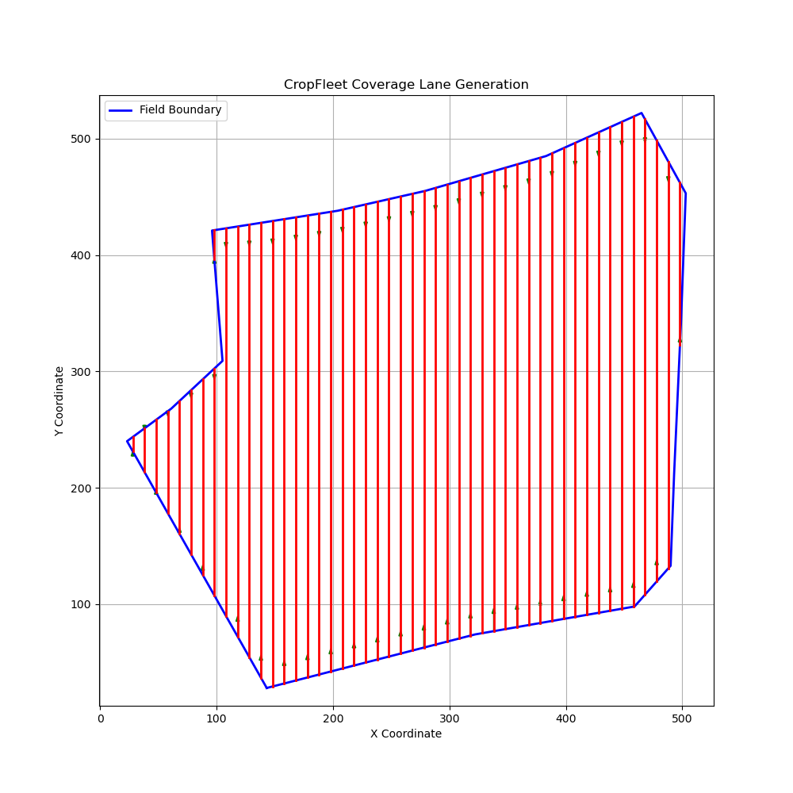
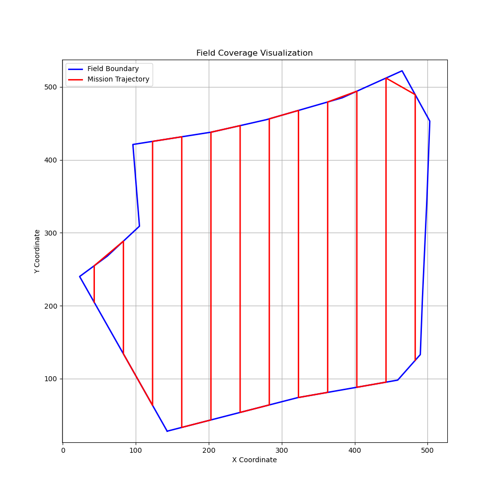
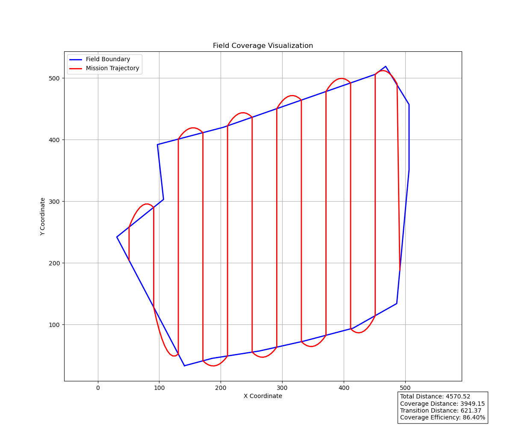

# CropFleet

A computational geometry research project for **coverage-planning and mission-generation** in autonomous agricultural drones. CropFleet generates waypoint-based coverage missions for irregular agricultural field geometries using sweep-line algorithms and geometric path planning.

## Overview

CropFleet focuses on the geometric and algorithmic aspects of field coverage planning:

- **Coverage lane generation** via parallel sweep-line clipping
- **Traversal ordering** using boustrophedon ordering
- **Mission waypoint synthesis** from coverage segments
- **Geometric path smoothing** using Bezier curves
- **Coverage metrics** and mission efficiency analysis
- **Interactive field mapping** and visualization

## Scope

This project is **focused on geometric mission planning research** and does not currently include:
- Flight control or vehicle dynamics
- Real-time autonomy or replanning
- Localization or state estimation
- Hardware deployment or middleware integration
- Multi-agent coordination (future research direction)

---

## System Architecture

The planning pipeline is structured as a series of geometric processing stages:

```
1. Field Polygon Definition
   └─ Load and validate field boundary

2. Coverage Lane Generation
   └─ Generate parallel sweep lines clipped to polygon

3. Traversal Ordering
   └─ Order lanes in boustrophedon pattern

4. Mission Waypoint Generation
   └─ Construct waypoint path from ordered segments

5. Transition Smoothing
   └─ Apply Bezier curve smoothing between turns

6. Metrics & Analysis
   └─ Calculate coverage efficiency and path statistics

7. Visualization
   └─ Display results and mission metrics
```

---

## Results & Visualization

### Coverage Lane Generation

Parallel sweep lines automatically clipped to irregular polygon boundaries:



### Mission Waypoint Path

Connected waypoints from ordered coverage segments:



### Smoothed Mission with Transitions

Bezier curve smoothing applied to segment transitions:



**Example Metrics:**
- Total Path Distance: 4570.52 pixels
- Coverage Distance: 3949.15 pixels  
- Transition Distance: 621.37 pixels
- **Coverage Efficiency: 86.40%**

---

## Project Structure

```
coverage_planner/
├── coverage/          # Lane generation and clipping
├── environments/      # Field polygon loading and bounds
├── metrics/           # Mission statistics and analysis
├── mission/           # Waypoint generation and smoothing
├── path/              # Traversal ordering
├── sketcher/          # Interactive boundary mapping
└── visualization/     # Mission visualization
```

---

## Usage

### Field Boundary Mapping

```bash
python3 -m coverage_planner.sketcher.map_bound
```
Interactive tool for defining field boundaries from reference images.

### Generate and Visualize Coverage Mission

```bash
python3 -m coverage_planner.visualization.visualization
```
Generates coverage lanes, plans traversal, and displays mission statistics.

---

## Installation

### Requirements

- Python 3.8+
- NumPy
- Matplotlib
- Shapely
- OpenCV (cv2)

### Setup

```bash
# Clone repository
git clone https://github.com/yourusername/CropFleet.git
cd CropFleet

# Install dependencies
pip install numpy matplotlib shapely opencv-python

# Run visualization
python3 -m coverage_planner.visualization.visualization
```

---

## Research & Development

### Current Focus

- Sweep-line coverage algorithms for complex polygons
- Boustrophedon traversal ordering
- Path smoothing and transition geometry
- Coverage metrics and efficiency analysis
- Field boundary extraction and validation

### Future Directions

- Cellular decomposition methods
- Multi-region field partitioning
- Obstacle-aware coverage
- Curvature-constrained paths
- Multi-agent field decomposition

---

## Development Roadmap

**Phase 1: Geometric Mission Planning** ✅ (Current)
- Field polygon representation
- Sweep-line coverage generation
- Waypoint synthesis and smoothing
- Coverage metrics

**Phase 2: Advanced Planning** 🔄 (Future)
- Multi-region decomposition
- Obstacle-aware coverage
- Adaptive coverage planning
- Curvature constraints

**Phase 3: Integration** 📋 (Future)
- Flight control integration
- Hardware deployment
- Autonomous operations
- Multi-agent coordination

---

## Technology Stack

### Current Technologies
- **Python 3.8+** - Core development language
- **NumPy** - Numerical computations
- **Matplotlib** - Visualization
- **Shapely** - Computational geometry
- **OpenCV** - Image processing and field mapping

### Planned Integration
- **ROS 2** - Middleware for drone integration
- **PX4** - Autopilot software
- **Gazebo** - Simulation environment
- **C++** - Performance-critical components

---

## Research Disclaimer

**This is a research project focused on computational geometry and mission planning algorithms.** The system currently:

- Generates geometric waypoint paths (not real trajectories)
- Processes offline, designed for mission planning (not real-time autonomy)
- Outputs visualization and metrics only (no flight control or hardware integration)
- Handles simple to moderately complex polygonal fields
- Is under active development and not suitable for production deployment

## Status & Limitations

**Current Capabilities:**
- ✅ Polygon-based field representation
- ✅ Sweep-line coverage generation
- ✅ Waypoint path synthesis
- ✅ Mission smoothing and metrics
- ✅ Interactive field mapping and visualization

**Not Included (Future Work):**
- Real-time autonomy or flight control
- State estimation or localization
- Obstacle avoidance or dynamics constraints
- Hardware integration or middleware
- Multi-agent coordination

**Known Limitations:**
- Offline planning (not real-time)
- Simple polygon geometries
- No vehicle dynamics modeling
- No collision detection or obstacle handling

---

## Contributing

Contributions welcome in these areas:
- Coverage decomposition algorithms
- Path smoothing and curvature constraints
- Field polygon handling improvements
- Visualization and analysis tools
- Documentation and examples

---

## Citation

```bibtex
@software{cropfleet2026,
  author = {Dheeraj},
  title = {CropFleet: Coverage Planning and Mission Generation for Agricultural Drones},
  year = {2026},
  url = {https://github.com/dheerajsankar/CropFleet}
}
```

## License

Open source. See LICENSE file for details.

## Contact

For questions or collaboration:
- Open an issue on GitHub
- Contact: Dheeraj Sankar Narayana Mangalath

**Last updated:** May 2026
